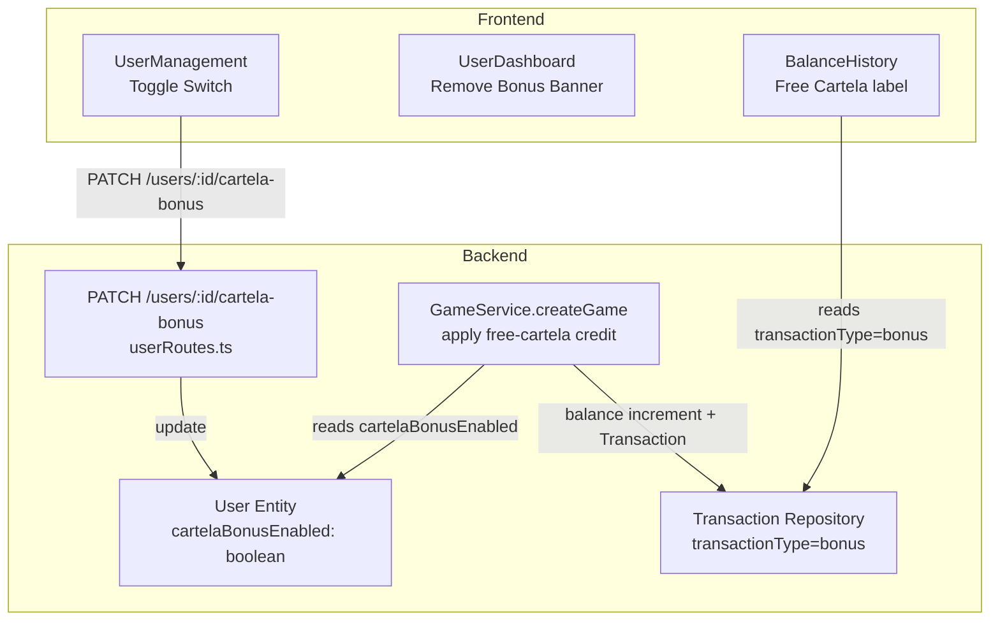

# Design Document: Cartela Bonus System

## Overview

This feature replaces the existing daily-profit-threshold bonus (`applyDailyBonusIfEligible`) with a simpler per-game free cartela bonus. Every time an eligible user creates a game, the system credits their balance with an amount equal to `betAmount`, effectively making one cartela free. Eligibility is controlled by a new `cartelaBonusEnabled` boolean flag on the user record, toggled by admins or agents through a new API endpoint and a UI switch in UserManagement.

The change is scoped to three main areas of the codebase:
1. **Backend – GameService**: Remove old bonus logic; add free-cartela credit inside `createGame`.
2. **Backend – User API**: Add `PATCH /users/:id/cartela-bonus` endpoint; update `User` entity and migration.
3. **Frontend**: Remove daily bonus banner from UserDashboard; add toggle in UserManagement; ensure BalanceHistory labels bonus transactions correctly.

---

## Architecture



The flow is strictly server-authoritative: the frontend sends toggle requests, the server validates them, and game creation checks the flag directly from the DB within the same transaction that creates the game.

---

## Components and Interfaces

### 1. User Entity (Backend)

File: `fidel-bingo/backend/src/modules/user/domain/User.ts`

- Add `cartelaBonusEnabled: boolean` column, defaulting to `false`.
- Update `sanitize()` to include `cartelaBonusEnabled` in the returned object.

### 2. Database Migration

A TypeORM migration adds the column:

```sql
ALTER TABLE users ADD COLUMN cartela_bonus_enabled BOOLEAN NOT NULL DEFAULT FALSE;
```

Existing rows get `false` automatically (no data loss).

### 3. GameService.createGame (Backend)

File: `fidel-bingo/backend/src/modules/game/application/GameService.ts`

Changes inside `createGame`:
- Fetch `cartelaBonusEnabled` in the initial user query (add to `select` list).
- Remove any calls to `applyDailyBonusIfEligible`.
- Inside the existing `AppDataSource.transaction` block, after saving the game:
  - If `user.cartelaBonusEnabled === true` AND `dto.betAmountPerCartela > 0`, apply credit atomically.

```typescript
// Inside the transaction, after savedGame is created:
if (user.cartelaBonusEnabled && dto.betAmountPerCartela > 0) {
  await Promise.all([
    manager.increment(User, { id: userId }, 'balance', dto.betAmountPerCartela),
    manager.save(
      manager.create(Transaction, {
        userId,
        gameId: savedGame.id,
        transactionType: 'bonus',
        amount: dto.betAmountPerCartela,
        status: 'completed',
        description: `Free cartela bonus for game ${savedGame.id}`,
        processedAt: new Date(),
      })
    ),
  ]);
}
```

- Remove the private `applyDailyBonusIfEligible` method entirely.

### 4. PATCH /users/:id/cartela-bonus (Backend)

File: `fidel-bingo/backend/src/modules/user/interfaces/userRoutes.ts`

New route, protected by `authenticate` + `authorize('admin', 'agent')`:

```
PATCH /users/:id/cartela-bonus
Body: { "enabled": true | false }
```

Logic:
1. Validate `enabled` is strictly a boolean; return `400 VALIDATION_ERROR` otherwise.
2. Load target user; 404 if not found.
3. Call `assertAgentOwns(actor, target)` for agents (throws 403 if not their user).
4. `UPDATE users SET cartela_bonus_enabled = :enabled WHERE id = :id`.
5. Return updated `user.sanitize()`.

### 5. Remove /games/bonus/today (Backend)

File: `fidel-bingo/backend/src/modules/game/interfaces/gameRoutes.ts`

- Delete the `router.get('/bonus/today', ...)` route handler.

### 6. adminApi.setCartelaBonus (Frontend)

File: `fidel-bingo/frontend/src/services/api.ts`

Add to `adminApi`:

```typescript
setCartelaBonus: (id: string, enabled: boolean) =>
  api.patch(`/users/${id}/cartela-bonus`, { enabled }),
```

### 7. UserManagement Bonus Toggle (Frontend)

File: `fidel-bingo/frontend/src/pages/admin/UserManagement.tsx`

- Update `UserRecord` interface to include `cartelaBonusEnabled: boolean`.
- Add a `useMutation` that calls `adminApi.setCartelaBonus`.
- In the desktop table's Actions column and the mobile card, add a toggle button (or pill switch) that:
  - Shows current `cartelaBonusEnabled` state.
  - Is disabled while the mutation is pending (loading state on that specific row).
  - On success, calls `invalidate()` to refresh the user list.
  - On error, shows an inline error toast/message.

### 8. UserDashboard: Remove Bonus Banner (Frontend)

File: `fidel-bingo/frontend/src/pages/user/UserDashboard.tsx`

- Remove the `useQuery(['bonus-today'])` query.
- Remove the `{bonusStatus && (...)}` JSX block (the "Daily Bonus Applied" and "Daily Bonus Progress" banners).

### 9. BalanceHistory: Free Cartela Label (Frontend)

File: `fidel-bingo/frontend/src/pages/user/BalanceHistory.tsx`

The `TX_LABEL` map already has a `bonus` entry (shown as "Bonuses" in summary). We need to verify it renders with a `+` sign and `"Free Cartela"` label. If not, update `TX_LABEL['bonus']` to:

```typescript
bonus: { label: 'Free Cartela', sign: '+', color: '#fbbf24' },
```

The existing `totalBonus` computation (filtering `transactionType === 'bonus'`) and the "Bonuses" summary card already handle the totals correctly — no additional changes needed there.

---

## Data Models

### User Entity (updated)

```typescript
@Column({ name: 'cartela_bonus_enabled', default: false })
cartelaBonusEnabled!: boolean;
```

Added to `sanitize()` return (already destructures `passwordHash` and `mfaSecret`; everything else is spread).

### Transaction (no changes)

The existing `Transaction` entity already supports `transactionType: 'bonus'`, `amount`, `status`, `description`, and `gameId`. No schema changes needed.

### CreateGameDTO (no changes)

The DTO already carries `betAmountPerCartela` and `cartelaIds`. No new fields needed.

---

## Correctness Properties

*A property is a characteristic or behavior that should hold true across all valid executions of a system — essentially, a formal statement about what the system should do. Properties serve as the bridge between human-readable specifications and machine-verifiable correctness guarantees.*

### Property 1: Eligible user credit round-trip

*For any* eligible user (cartelaBonusEnabled = true) and any game created with betAmount > 0, after game creation: (a) a bonus transaction should exist with transactionType = 'bonus', amount = betAmount, status = 'completed', and description containing the gameId, and (b) the user's balance should have increased by betAmount relative to its pre-creation value (net of the house cut deduction).

**Validates: Requirements 3.1, 3.2**

### Property 2: No bonus for non-eligible users or zero-bet games

*For any* user where cartelaBonusEnabled = false, or any game where betAmount = 0, after game creation no transaction with transactionType = 'bonus' linked to that gameId should exist, and the balance should not have been incremented by any bonus amount.

Edge case: betAmount = 0 is included to ensure the guard applies even to eligible users.

**Validates: Requirements 3.3, 3.5**

### Property 3: Bonus credit atomicity invariant

*For any* game creation sequence, the database should never contain a committed game row without its corresponding bonus transaction, nor a bonus transaction without a committed game row — both are created in the same DB transaction or neither is.

**Validates: Requirements 3.4**

### Property 4: Agent ownership enforcement on bonus toggle

*For any* agent and any user whose `createdBy` field does not match that agent's id, a PATCH request to `/users/:id/cartela-bonus` should return 403, and the user's cartelaBonusEnabled flag should remain unchanged.

**Validates: Requirements 4.3**

### Property 5: Invalid `enabled` values are rejected

*For any* value supplied for the `enabled` field that is not a strict boolean (i.e., not `true` or `false` — including strings "true"/"false", numbers, null, objects, etc.), the PATCH /users/:id/cartela-bonus endpoint should return 400 VALIDATION_ERROR.

**Validates: Requirements 4.4**

### Property 6: cartelaBonusEnabled round-trips through sanitize and API response

*For any* user record with cartelaBonusEnabled set to either true or false, calling sanitize() should produce an object whose cartelaBonusEnabled field equals the original value. Equivalently, after a successful PATCH /users/:id/cartela-bonus, the returned sanitized user should reflect the value that was set.

**Validates: Requirements 2.3, 4.5**

### Property 7: BalanceHistory renders bonus transactions with correct label and sign

*For any* transaction record with transactionType = 'bonus', the BalanceHistory rendering logic should produce output that contains the label "Free Cartela" and a '+' sign prefix on the amount.

**Validates: Requirements 6.1**

### Property 8: BalanceHistory totals include all bonus amounts

*For any* list of transactions that contains one or more bonus transactions, the computed Bonuses total in the summary should equal the sum of the amounts of all completed bonus transactions in that list.

**Validates: Requirements 6.2**

---

## Error Handling

| Scenario | Code | Response |
|---|---|---|
| `enabled` is not a boolean | `400 VALIDATION_ERROR` | `{ success: false, error: { code: 'VALIDATION_ERROR', message: 'enabled must be a boolean' } }` |
| Target user not found | `404 NOT_FOUND` | Standard 404 |
| Agent attempts to manage another agent's user | `403 FORBIDDEN` | Standard 403 (reuses `assertAgentOwns`) |
| Game creation transaction fails mid-flight | DB rolls back atomically; credit is not applied | |
| Toggling bonus for a suspended user | Allowed — the flag is independent of account status |

No new error types are needed; existing `AppError` and the global error handler cover all cases.

---

## Testing Strategy

### Unit / Integration Tests

- `userRoutes.test.ts`: Add tests for the new `PATCH /users/:id/cartela-bonus` endpoint covering:
  - Admin can set to true/false for any user.
  - Agent can set for their own user; 403 for another agent's user.
  - Non-boolean `enabled` value → 400.
  - Updated user is returned via `sanitize()`.
- `GameService` unit test: Verify that `createGame` does not call `applyDailyBonusIfEligible` at all.
- Snapshot / smoke test: Verify `GET /games/bonus/today` returns 404 after removal.

### Property-Based Tests

The project uses **fast-check** on both the backend (Jest + fast-check) and the frontend (Vitest + fast-check).

Each property-based test MUST run a minimum of 100 iterations (fast-check default is 100 runs; leave `numRuns` unset or set to 100+).

Each test MUST carry a comment tag in the format:
**`Feature: cartela-bonus-system, Property {N}: {property_text}`**

**Backend (Jest + fast-check)**

- Property 1 — `fc.float({ min: 0.01, max: 1000 })` for betAmount, user with `cartelaBonusEnabled = true`. Mock the DB transaction manager; verify `manager.increment` was called with `betAmount` and `manager.save` was called with a transaction matching all required fields (type, amount, status, description containing gameId).
- Property 2 — Separate runs with `cartelaBonusEnabled = false` and with `betAmount = 0` (edge case). Assert `manager.increment` and the bonus `manager.save` were never called.
- Property 3 — Simulate a DB error on `manager.save` for the bonus transaction; use `fc.boolean()` for eligibility. Verify the outer `AppDataSource.transaction` throws, meaning no game row is committed.
- Property 4 — `fc.uuid()` for agentId, `fc.uuid()` for user.createdBy (generated to never match). Call `assertAgentOwns`; assert it throws `AppError` with code 403.
- Property 5 — `fc.anything().filter(v => v !== true && v !== false)` for `enabled`; call the route handler; assert 400 VALIDATION_ERROR is returned.
- Property 6 — `fc.boolean()` for `cartelaBonusEnabled`. Build a `User` instance, call `sanitize()`, assert returned object's `cartelaBonusEnabled` equals the input.

**Frontend (Vitest + fast-check)**

- Property 7 — `fc.record({ transactionType: fc.constant('bonus'), amount: fc.float({ min: 0.01 }), ... })`. Pass through the TX_LABEL lookup used in BalanceHistory; assert label = "Free Cartela" and sign = "+".
- Property 8 — `fc.array(fc.record({ transactionType: fc.constantFrom('bonus', 'bet', 'deposit'), amount: fc.float({ min: 0 }), status: fc.constant('completed') }))`. Compute `totalBonus` with the same filter logic as the component; assert it equals the sum of amounts where type = 'bonus' and status = 'completed'.
